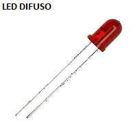
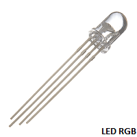

# oop-arduino-ejemplo-led-difuso
Programación orientada a objetos. Ejemplo Led Difuso. 


# Programación orientada a objetos (OOP)

La programación orientada a objetos con Arduino es la forma más clara de explicar el concepto de lo real y abstracto que rodea nuestro entorno. Permite interactuar directamente con componentes electrónicos que por definición propia son objetos del mundo real. 

**Nota:**
Hay que diferenciar entre programar objetos con Arduino y programar bajo el concepto de programación orientada a objetos. Es totalmente diferente.

El ejemplo más popular de interaccion y control de un objeto es el hola mundo de Arduino. Este consiste en encender un led que viene conectado en el pin 13 de la board Arduino.

**Mira este ejemplo sin OOP**

Este es el ejemplo de interacción del cual te mencione anteriormente. Aquí se programa el funcionamiento de un Led.

```C
const int ledPIN = 13;
   
void setup() {
  pinMode(ledPIN , OUTPUT);      // Definir pin como salida
}
   
void loop(){
  digitalWrite(ledPIN , HIGH);   // Poner el Pin en HIGH
  delay(1000);                   // Esperar un segundo
  digitalWrite(ledPIN , LOW);    // Poner el Pin en LOW
  delay(1000);                   // Esperar un segundo
}
```


# Empezando con OOP y Arduino

Antes de empezar es necesario tener claro los siguientes conceptos para poder entender la teoria de objetos en la programación. Aqui solo explicare los conceptos basicos para adentrarnos en este paradigma de programación.

**Estos son los siete conceptos básicos:**

**1- OBJETO:**
Es la representación real o abstracta de una clase.

**2- CLASE:**
Determina los atributos y comportamientos de un objeto.

**3- ATRIBUTO:**
Es una cualidad o característica propia de un objeto

**4- CONSTRUCTOR:**
Es el que asigna e inicializa los atributos de un objeto.

**5- MÉTODO:**
Define todo o parte del comportamieto o funcionamiento del Objeto.

**6- INSTANCIA:**
Se llama instancia a todo objeto que derive de otro.

**7- LLAMAR:**
Es decirle al objeto que realice el método programado previamente y que necesitamos ejecutar.


# Explicación de teoría de objetos con Leds.

En este orden de conceptos podemos decir que en el mundo real existen LEDS y existen diferentes CLASES de LEDS. Mencionando rapidamente dos CLASES de LEDS  encontramos que existen los LEDS Difusos y los LEDS RGB.

 


# ¿Cuál es la diferencia?

Tengamos en cuenta que la diferencia entre un objeto y otro son los ATRIBUTOS físicos que pueden llegar a tener, es decir aquello que podemos tocar.

Entre los objetos LED Difuso y LED RGB existen diferencias de ATRIBUTOS. Estas diferencias son la cantidad de pines que tienen. 

El LED difuso tiene dos pines, uno es el pin positivo y el otro pin es el negativo.

El LED RGB tiene cuatro pines de conexión, un pin es el negativo y los otros tres pines son positivos.

# Analicemos la teoria OPP utilizando el Led Difuso

**¿Qué tenemos hasta ahora?**

- Tenemos un OBJETO (Led)
- Tenemos una CLASE (Difuso)
- Tenemos ATRIBUTOS (Pin positivo y Pin negativo)

**Descubramos un poco más sobre los ATRIBUTOS del Led Difuso**

Eléctricamente el pin positivo del Led Difuso es el que se conecta a cualquiera de las entradas o salidas multipropósito de la board Arduino y es este pin el que determina si se enciende o se apaga el Led Difuso. El pin negativo siempre se conecta al pin negativo o ground de la board Arduino para cerrar el circuito  y que fluya la corriente eléctrica. Este pin negativo no influye diretamente sobre el control del Led Difuso.

Sabiendo esto concluimos que el control de un objeto eléctrico o electrónico esta determinado por una sola señal y esta señal esta asociada a un pin de la board Arduino.

Conociendo esto tenemos que el Led Difuso solo tiene UN ATRIBUTO REAL para ser controlado. Este ATRIBUTO es el pin positivo.

Hasta ahora solo hemos hablado del OBJETO Led y de la CLASE Difuso y de su ATRIBUTO de control que es el pin positivo. También hemos mencionado que lo podemos controlar pero no sabemos en base a que podemos realizar el control. Analicemos lo siguiente:


**Analicemos las acciones que puede hacer el Led Difuso**

Un Led Difuso puede estar encendido o apagado, pero para observar si el Led Difuso esta encendido o apagado debe haber una espera de tiempo. En programación orientada a objetos a estos conportamientos se les conoce como MÉTODOS y son las acciones que puede hacer el OBJETO.

Ahora tenemos que nuestro objeto Led Difuso tiene tres MÉTODOS base (encendido, espera y apagado) y con estos tres MÉTODOS se pueden hacer miles de convinaciones posibles.


# Procedamos a la construcción del objeto

Una vez tenemos definido de que se compone nuestro objeto procedemos a construirlo. 

En programación orientada a objetos para dar forma a un objeto se utiliza lo que llamamos constructor de la clase, y es donde se le indica a la clase los atributos de los cuales se compone el objeto.

Teniendo en cuenta lo anterior y el analisis previo hecho sobre ATRIBUTOS podemos decir que para construir el objeto Led Difuso solo necesitamos asignar un Atributo al Constructor de la clase. Este Atributo corresponde a un numero de pin de la board Arduino que se utilizara para conectar el Led y luego ser controlado.

De esta forma damos por construido fisicamente o virtualmente nuestro objeto Led Difuso.

Ya esta creado el objeto Led Difuso. Ahora le daremos accion, es decir, le asignaremos MÉTODOS.


# Dando acción al Led Difuso

El objeto led tendra diferentes acciones o MÉTODOS como se conoce en OOP.  

Puede ser que el Led siempre permanesca encendido, apagado o que haga una combinacion de ambas, icluso que el Led se encienda y se apague las veces que queramos.

El procedimiento para esto es primero declarar o definir los métodos que se utilizaran y luego programar esas acciones. En esta parte se empieza a definir la logica de funcionamiento del objeto como tal.


# Miremos este ejemplo utilizando OOP

Para esto debemos tener en cuenta lo siguiente:

Para que el código del archivo .ino funcione se requiere de dos archivos que son el (.cpp y el .h). 

- En el .h se define y se construye el objeto.

- En el .cpp se inicializa y se da accion al objeto.

- En el archivo .ino se hace un include del archivo .h para que toda la logica del objeto creado previamente pueda funcionar.

**¿Por que tanta cosa para encender un led?**

Son muchas las ventajas a futuro, la OOP nos permite fácilmente la reutilizacion de código y la depuracion facil de errores, además, nos permite realizar muchisimos prototipos en un lapso de tiempo menor. La legibilidad del código es mejor y más entendible.

# Finalmente este es el código con OOP

Para probar este código debes copiar y pegar el contenido de la carpeta oopLedDifuso donde tengas las librerías de Arduino. Otra forma de hacerlo es comprimir la carpeta oopLedDifuso en un .zip y luego importarla desde el IDE de Arduino. La importacion es igual que la de cualquier librería de Arduino, después de haberla importado o agregado puedes ir a la sección de ejemplos del IDE de Arduino y en la parte inferior encontraras el ejemplo que hemos creado con el nombre de oopLedDifuso. Te recuerdo que lo que hacemos finalmente al programar bajo el concepto de programación orientada a objetos es crear nuestras propias librerías.


**Este es el archivo oopLedDifuso.h**

```C
#ifndef LedDifuso_h
#define LedDifuso_h
/*============================================================
  Incluye la librería Arduino para poder ejecutar sus 
  instrucciones.
============================================================*/    
#include "Arduino.h" 
class LedDifuso{  
    /*================== Atributo de Objeto ================*/
    int pinLedDifuso;     
    /*======================================================*/
    public:
        /*=================== CONSTRUCTOR ==================*/      
        LedDifuso(int _pinLedDifuso);            
        /*===================== MÉTODOS ====================*/                
        void blinkFast();     
        /*==================================================*/
};
#endif
```


**Este es el archivo oopLedDifuso.cpp**

```C

/*===== Se  incluye el archivo donde se creó el objeto =====*/
#include <oopLedDifuso.h>
/*====================== CONSTRUCTOR========================*/
LedDifuso::LedDifuso(int _pinLedDifuso){  
  pinLedDifuso = _pinLedDifuso;
}
/*======================== MÉTODOS =========================*/        
void LedDifuso::blinkFast()
{   
  digitalWrite(pinLedDifuso, HIGH);
  delay(100);
  digitalWrite(pinLedDifuso, LOW); 
  delay(100); 
}

```


**Este es el archivo oopLedDifuso.ino**

```C
/*===== Se  incluye el archivo donde se creó el objeto =====*/
#include <oopLedDifuso.h> 
/*==== Se indica cual sera el pin para crear el objeto =====*/
const int _pinLedDifuso = 13;        
/* Se hace una instancia del objeto creado en el archivo .h */
LedDifuso LedDifuso(_pinLedDifuso);              
void setup() {  
  /* Se hace la configuración del pin para crear el objeto  */
  pinMode(_pinLedDifuso , OUTPUT);   
}
void loop() {   
  /*==========================================================
  Se llama el método del archivo .cpp para dar accion al
  objeto creado en el archivo .h 
  ==========================================================*/
  LedDifuso.blinkFast();                
}
```
